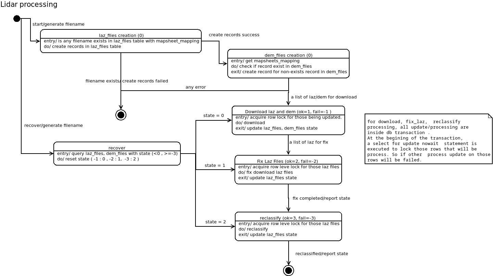

# Code supplement: Towards National-Scale Ecological Applications: Harmonised framework for LiDAR point cloud processing for vegetation metrics calculation

Code supplement: Towards National-Scale Ecological Applications: Harmonised framework for LiDAR point cloud processing for vegetation metrics calculation

# Preprocessing workflow

## DB Setup

<ol>
  <li>
  	Create 3 tables in Postgresql. The sql script can be found under /setup/db.
  	
  </li>
</ol>

## Installation
<ol>
<li> create virtual environment 
```
micromamba create -n myenv -f ./micromamba_env.yaml
```
</li>
<li> poetry install
```
micromamba activate myenv
poetry install
```
</li>
<li> It will create a executable scripts under the env's bin folder which you can call directly.

<ol>
- To run the processing in normal mode:
```
lidarprocessing -c <config yaml>  -i <identifier>
```

- To run the processing in recovery mode:
```
lidarprocessing -c <config yaml>  -r <identifier>
```
</ol>
</li>

</ol>

## How it works?

### Processing with individual laz file

The processing for laz file consist of 2 steps (/model/processing_script)

- fix laz file [fix_laz.py](lidar_processor/model/processing_script/fix_laz_file.py): 
	1. Remove overlapping points
	2. Assign correct CRS (EPSG:3301)
	3. Writes out the fixed file in LAZ version 1.4

- reclassification [reclassify_laz_file.py](lidar_processor/model/processing_script/reclassify_laz_file.py)
	1. Identification of points within sea polygons (Estonian Topographic Database (ETD) layer `E_201_meri_a`) with the binary attribute `WithinSea` assigned.
    2. Identification of points within 13 m buffers of high voltage (110, 220 or 330 kV) powerlines (ETD layer `E_601_elektriliin_j`) with the binary attribute `WithinPowerline` assigned.
    3. Identification of points within inland waterbody polygons (ETD layers `E_202_seisuveekogu_a`, `E_203_vooluveekogu_a`) with the binary attribute `WithinWaterBody` assigned.
    4. Identification of points located within building polygons (ETD layers `E_401_hoone_ka` and `E_403_muu_rajatis_ka`), with the binary attribute `WithinBuilding` assigned.
    5. Calculating NDVI for each point by 1) using a seasonal NDVI raster as input for the PDAL function `filters.hag_dem` to calculate a temporary `HeightAboveGround` (HAG) attribute by subtracting NDVI from Z, 2) copying this temporary HAG into a new attribute called `NDVI` and 3) subtracting NDVI from Z to retrieve the original NDVI raster values. We used this workaround because there was no direct way to add NDVI values to the point cloud.
    6. Calculation of actual `HeightAboveGround` using the corresponding 1 m DTM (including support for VRT input) to overwrite the temporary HAG from the previous step.
    7. Assignment of new classification values based on defined rules, leveraging attributes added in the previous steps, while preserving original classifications in the attribute `OriginalClassification`.

The above 2 steps can be run individually by : 

<ol>
<li>

```bash
# fix_laz_file.py input_file output_file
python lidar_processor.model.processing_script.fix_laz_file 447696_2019_tava.laz 447696_2019_tava_fixed.laz
```
</li>

</l>

```bash
# reclassify_laz_file.py input_file output_file dem_file etak_file
python lidar_processor.model.processing_script.reclassify_laz_file 447696_2019_tava_fixed.laz 447696_2019_tava_reclassified.laz 54494_dem_1m_2017-2020.tif ETAK_EESTI_GPKG_2019_01_01/ETAK_EESTI_GPKG.gpkg
```
</li>
</ol>

### Processing with batch laz files

Since there are over millions of laz files to process, so it is need to keep track on the state for each file. 
The batch processing consist of 4 state : 

| state | process                   | failing state |
|:-----:|---------------------------|:-------------:|
|   0   | initial (record creation) |      Null     |
|   1   | laz/dem file downloaded   |       -1      |
|   2   | laz file fixed            |       -2      |
|   3   | laz file reclassified     |       -3      |

And the state will change according to the following diagram



Config file example:
```python 

db:
  dbname: 'dbname'
  db_schema: 'lidar_processing'
  user: 'user'
  password: 'xxxxxx'
  host: 'localhost'
  port: 5432
storage:
  gsjson: 'google_auth_json'
  bucket: 'gs://bucket'
  laz_path: 'test_lidar_processing/LAZ'
  fix_path: 'test_lidar_processing/LAZ_fixed'
  reclassify_path: 'test_lidar_processing/Reclassified'
  dem_path: 'test_lidar_processing/DTM'
  etak_path: './ETAK'
lidar:
  laz_mapsheets: [ 'laz_map_sheets_#' ]
  laz_to_crs: ''
  laz_year: 2017
  laz_type: 'tava'
  dem_year: 2017
 
```

If any exception occurs during the batch processing, at the end of the log, it should shows that recovery is needed.

Then, to recover for that particular job, just run lidarprocessing with `-r` option follow by the identifier name.